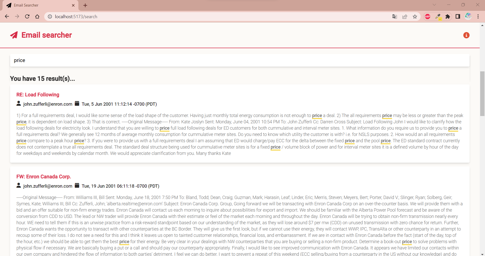

# Email platform challenge

It is a platform that index the emails from the Enron dataset and search for this emails within seconds.

It has a monorepo structure. See below the mobile and web preview.

|              Web version             |            Mobile version            |
| :----------------------------------: | :----------------------------------: |
|    |    |
|     |     |

## Tech Stack

- Backend: [Go](https://go.dev/)
- API Router: [Chi](https://github.com/go-chi/chi)
- Search Engine: [Zinc](https://github.com/zinclabs/zinc)
- Frontend: [Vue 3](https://vuejs.org/) + [Tailwind](https://tailwindcss.com/)
